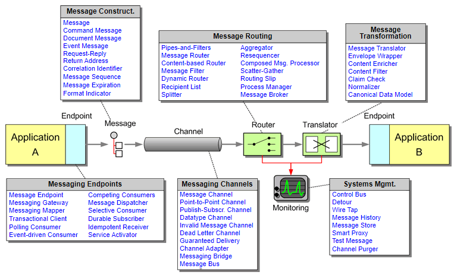
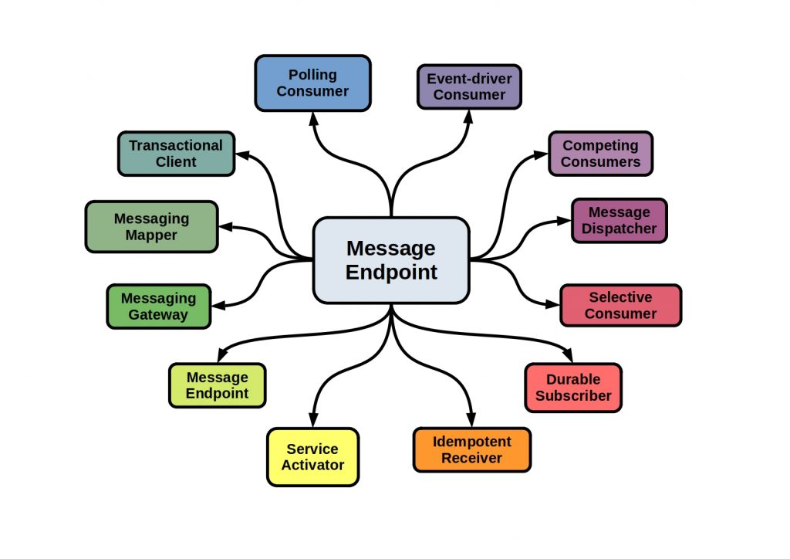

# Spring Integration Knowledge

## Core
+ Provide a simple model for integration solutions.
+ Provide asynchronous, message-driven behavior in a Spring application.
+ Supports integration with external systems via declarative adapters.
+ Spring Integration typically implements a "pipes-and-filters" approach where the "filters" are components that produce or consume messages and the "pipes" transport messages.



### Messaging Channels

<details>
  <summary>What is Messaging Channels?</summary>
  <br/>
  
  The `MessageChannel` decouples message producers from messgae consumers.

  ```
  public interface MessageChannel {

      boolean send(Message message);

      boolean send(Message message, long timeout);
  }
  ```
  _`MessageChannel` interface_
</details>
<details>
  <br/>
  <summary>Messaging Channels</summary>
  
  + Messaging Channels in EIP
  
  
  
  + Messaging Channels in Spring Integration
    + QueueChannel
    + PublishSubscribeChannel
    + PriorityChannel
    + DirectChannel
    + ...
</details>
<details>
  <br/>
  <summary>QueueChannel</summary>
  
  The `QueueChannel` implementation wraps a queue. The QueueChannel has point-to-point semantics. In other words, even if the channel has multiple consumers, only one of them should receive any Message sent to that channel.
  
  ```
  public QueueChannel(int capacity)
  ```
  
  If the queue has reached capacity, the sender blocks until room is available in the queue.
</details>
<details>
  <br/>
  <summary>PublishSubscribeChannel</summary>
  
  The `PublishSubscribeChannel` implementation broadcasts any Message sent to it to all of its subscribed handlers. This is most often used for sending event messages and the `PublishSubscribeChannel` is intended for sending only.
  
</details>
<details>
  <br/>
  <summary>PriorityChannel</summary>
  
  `PriorityChannel` is an alternative implementation that allows for messages to be ordered within the channel based upon a priority. By default, the priority is determined by the priority header within each message. A comparator of type `Comparator<Message<?>>` can be provided to the `PriorityChannel` constructor.
  
</details>
<details>
  <br/>
  <summary>DirectChannel</summary>
  
  The `DirectChannel` has point-to-point semantics but it implements the `SubscribableChannel` interface instead of the `PollableChannel` interface, so it dispatches messages directly to a subscriber. It sends each Message to a single subscribed `MessageHandler`.
  
</details>
<details>
  <br/>
  <summary>Messaging Channel API in Spring Integration</summary>
  
   These two sub-interfaces that define the buffering (pollable) and non-buffering (subscribable) channel behavior.
   
   ```
   public interface PollableChannel extends MessageChannel {

      Message<?> receive();

      Message<?> receive(long timeout);

   }
   ```
   **_PollableChannel_**
   ```
   public interface SubscribableChannel extends MessageChannel {

      boolean subscribe(MessageHandler handler);

      boolean unsubscribe(MessageHandler handler);

   }
   ```
   **_SubscribableChannel_**
</details>

<details>
  <br/>
  <summary>Channel Interceptor</summary>
  
  The `ChannelInterceptor` strategy interface
  ```
  public interface ChannelInterceptor {

      Message<?> preSend(Message<?> message, MessageChannel channel);

      void postSend(Message<?> message, MessageChannel channel, boolean sent);

      void afterSendCompletion(Message<?> message, MessageChannel channel, boolean sent, Exception ex);

      boolean preReceive(MessageChannel channel);

      Message<?> postReceive(Message<?> message, MessageChannel channel);

      void afterReceiveCompletion(Message<?> message, MessageChannel channel, Exception ex);
  }
  ```
  After implementing the interface, registering the interceptor with a channel
  
  ```
  channel.addInterceptor(someChannelInterceptor);
  ```
</details>

### Messages
The Spring Integration `Message` is a generic container for data.
```
public interface Message<T> {

    T getPayload();

    MessageHeaders getHeaders();

}
```
### Message Endpoint
<details>
  <summary>What is Message Endpoint?</summary>
  <br/>

  A Message Endpoint represents the “**filter**” of a _pipes-and-filters_ architecture. One of the primary goals is to simplify the development of enterprise integration solutions.
  
  In other words, you should **not** implement the consumer or producer directly. Instead, you can **focus on** your business implementation. 
  
  Just as a controller handles HTTP requests, the message endpoint handles messages. Just as controllers are mapped to URL patterns, message endpoints are mapped to message channels.
  
</details>
<details>
  <summary>Message endpoints</summary>
  <br/>
  
  + Messgae endpoints in EIP
  
  
  
  + Messgae endpoints in Spring Integration
    + Channel Adapter
    + Service Activator
    + Messaging Gateways
</details>
<details>
  <summary>Channel Adapter</summary>
  <br/>
  A channel adapter is a message endpoint that enables connecting a single sender or receiver to a message channel. Spring Integration provides a number of adapters to support various transports, such as JMS, file, HTTP, ...


  ```
  public class SourceService {

      @InboundChannelAdapter(channel = "channel1", poller = @Poller(fixedRate = "5000"))
      Object method1() {
          ...
      }

      @InboundChannelAdapter(channel = "channel2", poller = @Poller(cron = "30 * 9-17 * * MON-FRI"))
      Object method2() {
          ...
      }
  }
  ```
  _Configuring An Inbound Channel Adapter_

  ```
  public class MyPojo {

      @ServiceActivator(channel = "channel1")
      void handle(Object payload) {
          ...
      }

  }
  ```
  _Configuring An Outbound Channel Adapter_
</details>
<details>
  <summary>Service Activator</summary>
  <br/>
  The Service Activator is any POJO that defines the @ServiceActivator annotation on a given method. This allows us to execute any method on our POJO when a message is received from an inbound channel, and it allows us to write messages to an outward channel.
  
  

</details>
<details>
  <summary>Messaging Gateways</summary>
  <br/>
  Gateways are used to send and receive messages.
  
  ```
  @MessagingGateway // it also a bean
  public interface CustomGateway {

    @Gateway(requestChannel = "myUpperCaseChannel")
    public String sendToUppercaseChannel(String message);

  }
  ```
  
</details>

### Message Routing
<details>
  <summary>What is Message Routing?</summary>
  <br/>
  
</details>
<details>
  <br/>
  <summary>Message routings are supported by Spring Integration</summary>
  
</details>

### Message Transformation
<details>
  <summary>What is Message Transformation?</summary>
  <br/>
  
</details>
<details>
  <summary>Message transformation support by Spring Integration</summary>
  <br/>
  
</details>

## HTTP
## JMS
